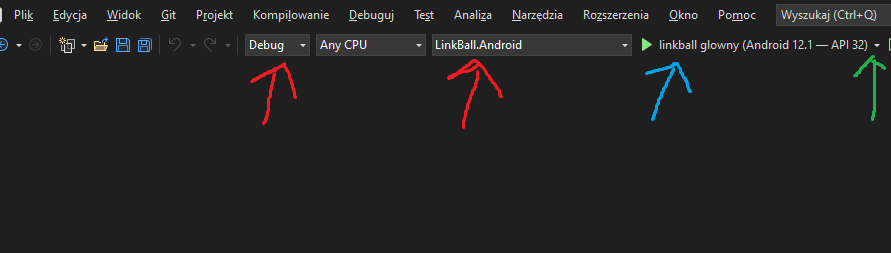
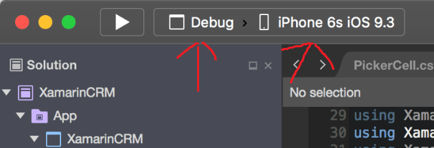

# metabo-app
# Table of Contens
* [How to run, windows](#how-to-run-windows)
* [How to run, mac](#how-to-run-mac)

Aby uruchomić aplikację, należy wykonać kilka kroków w zależności od systemu.

## How to run, windows

W systemie windows musimy pobrać Visual Studio najlepiej najnowesze 2022, może być wersja community. Podczas instalacji należy wybrać:
- opracowywanie zawartości dla platformy ASP.NET
- programowanie .NET Multi-Platform App UI
- dodatkowo w pojedynczych opcjach dodać Xamarin

Po pomyślnym zainstowaniu aby uruchomić kod trzeba otworzyć plik MetaboCoins.sln w głównym folderze aplikacji.
Następnie jeśli nie uruchamialiśmy jeszcze aplikacji na emulatorach androida musimy taki utworzyć. Robimy to poprzez wybranie opcji Debug oraz MetaboCoins.Android tak jak na zdjęciu przy czerwonych strzałkach. Następnie klikając w miejsce zaznaczoną zieloną strzałką wybieramy menadżer urządzeń Android i dodajemy nowe urządzenie najlepiej Pixel 5 reszta ustawień domyślna (jeśli mamy dużo pamięci RAM na komputerze możemy zwiększyć jej ilość na emulatorze). Następnie wybieramy nowo utworzony emulator (zielona strzałka i w liście powinien się pokazać emulator), jeśli w miejscu niebieskiej strzałki widzimy jego nazwe uruchamiamy na nim naszą aplikacje.

## How to run, mac

W przypadku mac'ów musimy pobrać Visual Studio Mac 2022. Podczas instalacji powinniśmy być poproszeni o doinstalowanie XCode, jeśli nie pojawi się taka opcja musimy zrobić to ręcznie.

Po pomyślnym zainstowaniu aby uruchomić kod trzeba otworzyć plik MetaboCoins.sln w głównym folderze aplikacji.
Następnie jeśli w miejscu zielonych strzałek wybieramy Debug oraz emulator iOS najlepiej Iphone 13 (na mac'u emulatory są dodane automatycznie). Po wybraniu odpowiednich opcji klikamy strzałkę Play aby uruchomić aplikację.

